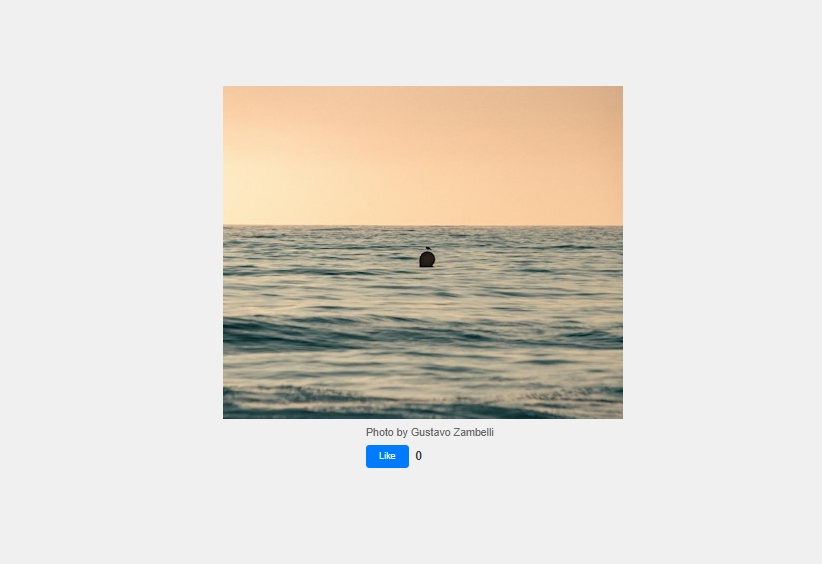
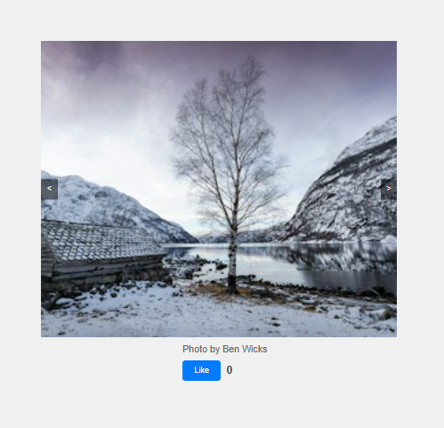

# Random Image

Это веб-приложение, которое отображает случайное изображение из коллекции Unsplash и позволяет пользователям ставить "лайк" этому изображению.

## Описание

Приложение получает случайное изображение с помощью API Unsplash при каждой загрузке страницы. Под изображением отображается имя фотографа, а также кнопка "лайк" и счетчик лайков. Пользователи могут нажимать на кнопку "лайк", чтобы отмечать изображения, которые им нравятся. Они могут ставить лайк только один раз для каждого изображения. Счетчик лайков сохраняется в локальном хранилище браузера, чтобы сохранить его даже после обновления страницы или закрытия браузера.

## Используемые технологии

- HTML
- CSS
- JavaScript

## Установка и запуск

1. Клонируйте репозиторий на свой компьютер:
git clone <URL репозитория>

2. Откройте файл `index.html` в вашем браузере.

## Инструкции по использованию

- При открытии страницы отображается случайное изображение из Unsplash.
- Нажмите кнопку "лайк", чтобы отметить понравившееся изображение.
- Счетчик лайков подсчитывает количество лайков для каждого изображения.
- Лайки сохраняются в локальном хранилище браузера и сохраняются даже после перезагрузки страницы.
